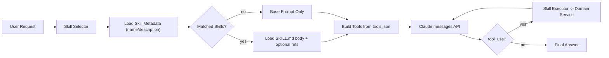

# data-server Skill 体系设计（Codex/Claude Code 形态）

## 1. 你要的“同款形态”定义

目标不是只做 `tools` 注册，而是做“技能包（Skill Package）”机制：
- 每个 skill 是一个目录
- 核心入口是 `SKILL.md`
- 支持显式触发（用户点名）+ 自动触发（描述匹配）
- 触发后才加载 skill 正文和资源（节省上下文）
- skill 可绑定现有 Java 业务能力（如 `GaoDeService`）

这就是 Codex/Claude Code 的使用体验核心。

## 2. 目录约定（建议）

在 `modules/data-server` 下新增：

```text
skills/
  gaode-poi/
    SKILL.md
    tools.json
    references/
      params.md
    scripts/
      normalize_region.sh
```

说明：
- `SKILL.md`：必需，含 frontmatter（至少 `name`、`description`）
- `tools.json`：可选，声明该 skill 暴露给模型的 tool schema
- `references/`：可选，详细知识，触发后按需加载
- `scripts/`：可选，可执行脚本（确定性处理）

## 3. SKILL.md 规范（服务端版）

示例：

```markdown
---
name: gaode-poi
description: 高德POI查询与聚类分析。用于“找地点分布、商圈分析、周边POI、按类型聚类”等请求。
---

1. 先根据用户意图选择工具：关键词查询/周边查询/聚类/综合分析。
2. region 缺失时先追问城市或行政区。
3. 返回时要给出可执行建议，不只返回原始POI。
4. 聚类结果优先展示 clusterCount、中心点、典型POI。

需要参数细节时读取 `references/params.md`。
```

关键点：
- 触发判断主要靠 frontmatter 的 `description`
- `SKILL.md` 正文是执行流程指导，不堆大段背景知识

## 4. 运行时架构



## 5. Java 模块划分

建议新增包：`com.jimeng.dataserver.ai.skill`

- `SkillPackageLoader`
  - 扫描 `skills/*/SKILL.md`
  - 解析 frontmatter + 正文

- `SkillMetadata`
  - `name`
  - `description`
  - `path`

- `SkillSelector`
  - 显式触发：用户消息含 `$gaode-poi` 或 `skill:gaode-poi`
  - 自动触发：基于 description 的关键词/向量匹配（MVP 先关键词）

- `SkillPromptAssembler`
  - 把命中的 `SKILL.md` 正文拼入 system prompt
  - 按需读取 references（只在正文要求时）

- `SkillToolCatalog`
  - 读取命中 skill 的 `tools.json`
  - 组装给 Claude 的 `tools`

- `SkillExecutor`
  - 执行 `tool_use`
  - 路由到已有 Java handler（底层调用 `GaoDeService`）

## 6. 与现有 data-server 代码的映射

你现在已有：
- `ClaudeController -> ClaudeService`
- `GaoDeService`（关键词/周边/聚类/分析）

改造建议：
1. 在 `ClaudeService.messages()` 里增加 skill 流程：
   - 选 skill
   - 拼 system prompt
   - 注入 tools
2. 新增 4 个 tool handler，直接封装已有方法：
   - `gaode.poi.keyword.search -> getPOIByKeyword`
   - `gaode.poi.around.search -> getPOIByAround`
   - `gaode.poi.cluster -> getPOICluster`
   - `gaode.poi.analysis.around -> analysisAroundPOI`
3. 保留原透传能力：当没命中 skill 或开关关闭时，走原逻辑

## 7. 使用体验（对齐 Codex/Claude Code）

### 7.1 显式触发
用户：
- “用 `$gaode-poi` 帮我分析徐汇区咖啡店商圈”

系统：
- 强制加载 `gaode-poi/SKILL.md`
- 开启该 skill 的 tools

### 7.2 自动触发
用户：
- “查杭州滨江周边写字楼并做聚类”

系统：
- `SkillSelector` 根据 description 命中 `gaode-poi`
- 自动加载 skill

### 7.3 无 skill
用户：
- “解释一下 DBSCAN 是什么”

系统：
- 不命中业务 skill
- 仅走通用模型回复

## 8. 配置设计（Nacos）

```yml
skill:
  enabled: true
  root-dir: ./skills
  auto-select-enabled: true
  max-selected: 3
  max-tool-rounds: 6
  fallback-to-pass-through: true
  explicit-prefix: "$"
```

## 9. 治理策略

- 安全
  - 只允许执行 skill 目录内白名单脚本
  - tool 参数严格 schema 校验
- 稳定性
  - 单 tool 超时
  - tool 调用轮次上限
- 可观测
  - 记录 `matchedSkills`、`toolCalls`、`latencyMs`、`traceId`

## 10. 分阶段落地

### M1（先做同款“形态”）
- 实现 `skills/` 目录扫描与 `SKILL.md` 解析
- 支持显式触发 `$skill-name`
- 在 Claude 请求中注入 skill 正文（先不做 tool）

### M2（补 tool 闭环）
- 接 `tools.json`
- 打通 `tool_use -> SkillExecutor -> GaoDeService`

### M3（完善自动触发与治理）
- 自动匹配策略（关键词/向量）
- 权限、超时、审计、灰度开关

## 11. 最小可用示例（建议先做这个）

只做一个 skill：`gaode-poi`
- 用户输入 `$gaode-poi + 自然语言需求`
- 模型可调用 2 个 tool：关键词搜索 + 聚类
- 返回结构化结论（簇中心、代表POI、建议）

这个版本上线后，你就已经是“Codex/Claude Code 风格的 skill 使用方式”。

## 12. 关键取舍

- 先做“文件驱动 skill + 显式触发”，最快获得同款体验。
- 自动触发可以后置，不影响第一版可用性。
- skill 只负责“指导与编排”，核心业务逻辑继续沉淀在 `GaoDeService`，避免重复实现。
